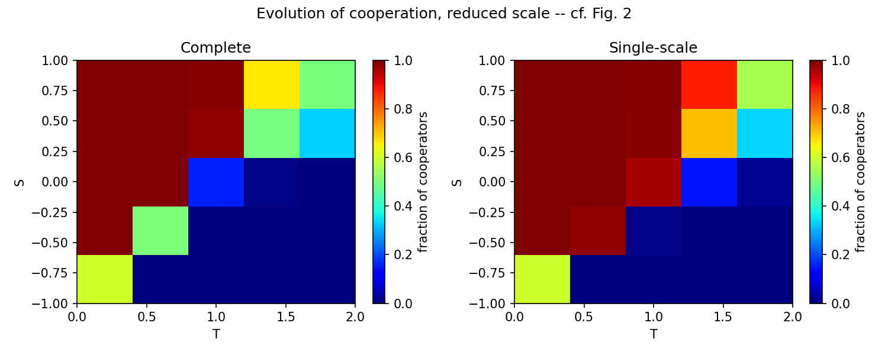
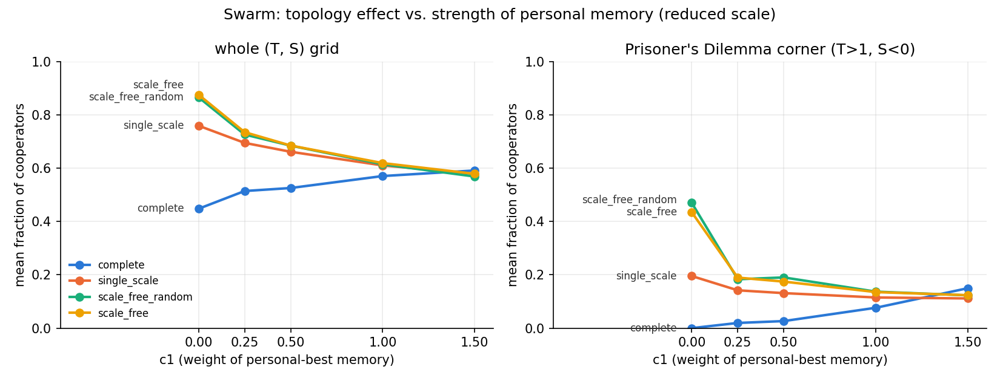

# Replication of "Evolutionary Dynamics of Social Dilemmas in Structured Heterogeneous Populations"

Source code replicating the model and central result of F. C. Santos, J. M. Pacheco &
T. Lenaerts, *"Evolutionary dynamics of social dilemmas in structured heterogeneous
populations,"* PNAS 103(9), 2006, pp. 3490-3494.

This is a from-scratch replication built for my PhD literature review (the
[Cooperation Atlas](https://github.com/CiMillan/cooperation-atlas) project), written to
demonstrate that I can take a paper's Methods section and turn it into working,
verifiable code -- not to outperform the original, and not vectorized for speed.

## What the paper shows, and what this reproduces

The paper asks whether the *structure* of a population -- who plays whom -- changes
whether cooperation survives a social dilemma. Agents sit on a graph, play a one-shot
game with their neighbors each generation, accumulate payoff, and occasionally copy a
better-performing neighbor's strategy. The paper compares four network types (complete
graph, single-scale, and two scale-free variants) across the (T, S) space that spans the
Prisoner's Dilemma, Snowdrift, and Stag Hunt games, and shows that heterogeneous
(scale-free) networks sustain cooperation across a much larger region of that space than
the well-mixed complete graph.

This repo reproduces the *shape* of that result (Figs. 2 and 3) at a reduced scale --
see [Honest deviations from the paper's protocol](#honest-deviations-from-the-papers-protocol)
below for exactly what was shrunk and why.

| Fig. 2 analogue -- complete vs. single-scale | Fig. 3 analogue -- random vs. Barabasi-Albert scale-free |
|---|---|
|  |  |

Both panels show the same qualitative pattern as the paper: the scale-free /
heterogeneous networks (right-hand panel in each figure) sustain a visibly larger blue
(high-cooperation) region than the more homogeneous network on the left.

## Requirements

Python 3.9+, and:
```
networkx
numpy
matplotlib
```
Install with `pip install networkx numpy matplotlib`.

## Code structure

**Foundation** -- the mechanism itself, matching the paper's Methods (p. 3493) exactly,
and unchanged no matter which experiment is run on top of it:
- `main.py` -- the core loop. `run()` does one realization (build a network, then loop
  generations of payoff -> update). `run_batch()` repeats `run()` across many
  independent realizations. `average_trace()` collapses those into one averaged trace,
  since the paper reports averaged results, not single noisy runs.
- `payoff.py` -- how accumulated payoff is computed each generation (every agent plays
  every graph neighbor once).
- `update_rule.py` -- how strategy changes: pairwise comparison. Pick one random
  neighbor, copy their strategy with a probability proportional to how much better they
  did.

**Swappable plug-in point** -- the "which network" slot the foundation calls into, not a
variant of the mechanism:
- `network.py` -- builds one of the paper's four network types: `complete`,
  `single_scale`, `scale_free`, `scale_free_random`. Swapping this runs the same
  foundation on a different population structure without touching `main.py`,
  `payoff.py`, or `update_rule.py` at all.

**Experiment scripts** -- add no new mechanism, just call the foundation repeatedly to
reproduce a specific figure:
- `sweep.py` -- runs `run_batch()` at every (T, S) grid point to reproduce the shape of
  the paper's Fig. 2/3 heatmaps.
- `plot.py` -- `plot_heatmap()` turns `sweep()`'s `{(T,S): fraction}` dict into one
  contour/image panel, same color scale (blue 0% to red 100%) as Figs. 2/3. `plot_pair()`
  lays two panels side by side the way the paper presents each figure. Neither runs any
  new simulation -- both just visualize `sweep()`'s output.
- `reduced_scale_figures.py` -- the runnable script that produced `fig2_reduced_scale.png`
  and `fig3_reduced_scale.png` above.

## Tests

Every function/file above has a matching plain-text test file (`test_*.txt`): the exact
terminal command to run, the expected output, and a short "why" explaining what the
output means and what would count as a bug versus an expected result. These are meant to
be run by hand, one at a time, rather than through a test runner -- see each file for the
command.

## Extensions (beyond the paper)

Two original experiments built on top of the replication. Each lives in its own
subfolder, imports the foundation above from `..` without modifying it, and has its own
`ARCHITECTURE.txt` (decisions made before building), `CONCLUSIONS.txt` (findings after
running) and `test_*.txt` files.

- `replication-extension-swarm/` -- swaps the paper's imitation update rule for a
  swarm (local-best PSO) rule, on a fixed Prisoner's Dilemma and scale-free network.
  Swarm plateaus far below imitation, because PSO's best-ever personal memory anchors
  agents to early defection windfalls.
- `replication-extension-swarm-topology/` -- fixes the update rule as swarm and varies
  the network across the paper's four types, with imitation as the baseline. With
  default swarm the paper's topology effect disappears. Switching off personal memory
  (`c1=0`) brings it back, stronger than under imitation. Intermediate `c1` values and a
  velocity test suggest any memory keeps agents oscillating, which breaks the
  hub-anchored cooperator clusters.

| Topology effect: imitation vs. swarm | Swarm topology effect vs. memory weight `c1` |
|---|---|
|  |  |

## Honest deviations from the paper's protocol

The paper's actual protocol is N=10,000 agents, 100 independent realizations per (T, S)
grid point, and 10,000 transient + 1,000 averaged generations per realization. This
implementation is deliberately simple -- plain Python dicts, one function per mechanism,
no vectorization -- to keep the code legible and directly traceable back to the paper's
equations. That legibility has a real runtime cost, measured directly on this machine:

| Network | Measured cost | Extrapolated to paper scale |
|---|---|---|
| Scale-free, n=10,000 | ~13 ms/generation | ~2.4 min/realization -> ~4 hours per (T,S) grid point |
| Complete graph, n=10,000 | ~12 s/generation | ~37 hours for a *single* realization |

At the paper's real resolution this would take days to weeks of wall-clock time, per
figure, on a single machine. Rather than claim figures I didn't actually produce, the
figures above use a documented reduced-scale substitute: smaller N (200-500 instead of
10,000), fewer realizations (10 instead of 100), and a shorter transient/averaging
window -- same structure (independent realizations, transient + averaging window, same
T/S range), just smaller. This preserves the *shape* of the result; expect more
finite-size noise near domain boundaries than the paper's own figures show.

Full details and a timing breakdown are in `ARCHITECTURE.txt`, which also lists the
concrete options for closing this gap (accept the reduced scale as a labeled deviation,
vectorize the hot path with numpy arrays, or run the full-scale version anyway in the
background over a longer window).
