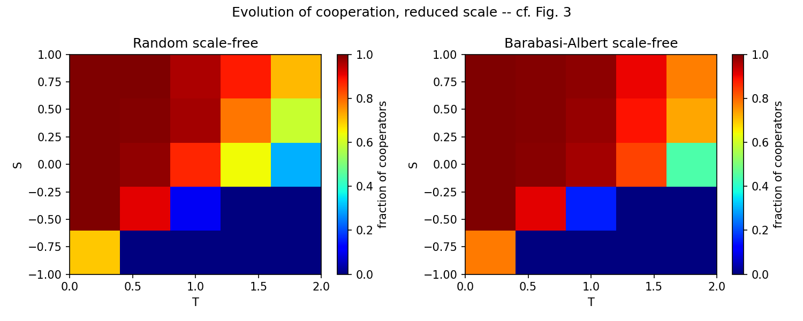

# Santos, Pacheco & Lenaerts (2006) — replication

Replication of F. C. Santos, J. M. Pacheco & T. Lenaerts, *Evolutionary dynamics of social
dilemmas in structured heterogeneous populations*, PNAS 103(9):3490–3494, 2006.

**Question.** Does population structure change whether cooperation survives a social dilemma?

**Model.** Agents sit on the nodes of a graph and play a one-shot two-player game with every
neighbour, with payoffs $R=1$, $P=0$, $T\in[0,2]$, $S\in[-1,1]$. Each generation, every agent
$x$ picks a random neighbour $y$ and, if $P_y > P_x$, adopts $y$'s strategy with probability

$$p = \frac{P_y - P_x}{k_{>} \cdot D_{>}}, \qquad k_{>} = \max(k_x, k_y), \qquad D_{>} = \max(T, 1) - \min(S, 0),$$

where $k_x$ is the number of neighbours of $x$, and $D_{>}$ is the largest possible payoff
difference in one game. Four networks: complete, single-scale, random scale-free and
Barabási–Albert scale-free (average degree 4).

**Result.** The shape of the paper's Figs. 2–3 is reproduced: heterogeneous networks sustain
cooperation over a larger region of (T, S). Mean cooperation over the grid rises from 0.49
(complete) to 0.57 (single-scale), 0.62 (random scale-free) and 0.65 (Barabási–Albert).

| Complete vs. single-scale (cf. Fig. 2) | Random vs. BA scale-free (cf. Fig. 3) |
|---|---|
|  |  |

**Deviation from the paper.** Reduced scale, because the pure-Python code would need years at
full scale:

| | Paper | Here |
|---|---|---|
| Population N | 10,000 | 500 (200 for complete) |
| Generations (transient + averaged) | 10,000 + 1,000 | 300 + 60 |
| Realizations per (T, S) point | 100 | 10 |

Run time for the 5×5 (T, S) grid, one core on a Mac (earlier timings in `ARCHITECTURE.txt`):

| Network | Here (measured) | Paper's scale (estimated) |
|---|---|---|
| Complete | 6 min | ≈ 11 years |
| Single-scale | 52 s | ≈ 4 days |
| Random scale-free | 62 s | ≈ 4 days |
| Barabási–Albert | 51 s | ≈ 4 days |
| **All four** | **9 min** | **≈ 11 years** |

The estimates use the measured time per generation at N = 10,000 (about 13 ms on the sparse
networks). For the complete graph the time grows with N², so it uses 126 ms at N = 1,000 × 100
≈ 13 s per generation. The paper's own grid is finer than 5×5, so its real cost is higher still.

The shape is reproduced but the exact values are not, and finite-size noise is larger.

## Code

- [`network.py`](network.py): builds the four networks: complete, single-scale, random scale-free and Barabási–Albert scale-free.
- [`payoff.py`](payoff.py): each agent plays every neighbour once per generation and adds up its payoffs.
- [`update_rule.py`](update_rule.py): the paper's imitation rule. An agent compares itself with one random neighbour and may copy that neighbour's strategy.
- [`main.py`](main.py): the core loop. It builds the network, gives out random strategies, then repeats payoff and update each generation. It also runs and averages several realizations.
- [`sweep.py`](sweep.py): runs the loop at every (T, S) point of the grid and returns the final cooperation level at each one.
- [`plot.py`](plot.py): turns the sweep results into (T, S) heatmaps like Figs. 2–3.
- [`reduced_scale_figures.py`](reduced_scale_figures.py): makes the two figures above at reduced scale and saves them in [`figures/`](figures/).
- [`ARCHITECTURE.txt`](ARCHITECTURE.txt): design decisions and timings.
- [`tests/`](tests/): one test per file, with the command, the expected output and what it means.

Requires Python 3.9+, `networkx`, `numpy` and `matplotlib`.

## Extensions

Each extension changes one part of the base model and holds the rest fixed:

| # | Variable under test | Held fixed |
|---|---|---|
| 1 | [**Swarm learning**](replications/replication-extension-swarm-learning/): the update rule, the paper's imitation vs. particle-swarm learning (PSO) | one Prisoner's Dilemma ($T=1.2$, $S=-0.1$) on the Barabási–Albert network |
| 2 | [**Swarm topology**](replications/replication-extension-swarm-topology/): the network type, all four; then PSO's memory weight $c_1$ | PSO update rule, $(T, S)$ grid |
| 3 | [**Stigmergic imitation**](replications/replication-extension-stigmergy/): what agents copy from, a neighbour's current payoff vs. a fading trace left at its node (memory $\lambda$) | imitation rule, four networks, $(T, S)$ grid |
| 4 | [**Open-source game theory**](replications/replication-extension-open-source/): what agents hold, a plain strategy vs. a program that reads the other's code; then a code-reading cost | imitation rule, four networks, $(T, S)$ grid |

**Scripts.** Row 0 is the base replication. Root scripts are never edited. *Changed* = a variant of a root script
(root → variant). *Created* = no root counterpart. Each folder keeps its tests in `tests/`.

| # | Scripts changed | Scripts created |
|---|---|---|
| 0 | — | [`main.py`](main.py), [`network.py`](network.py), [`payoff.py`](payoff.py), [`update_rule.py`](update_rule.py), [`sweep.py`](sweep.py), [`plot.py`](plot.py), [`reduced_scale_figures.py`](reduced_scale_figures.py) |
| 1 | [`update_rule.py`](update_rule.py) → [`swarm_update_rule.py`](replications/replication-extension-swarm-learning/swarm_update_rule.py); [`main.py`](main.py) → [`main_swarm.py`](replications/replication-extension-swarm-learning/main_swarm.py) | [`compare_imitation_vs_swarm.py`](replications/replication-extension-swarm-learning/compare_imitation_vs_swarm.py), [`plot_comparison.py`](replications/replication-extension-swarm-learning/plot_comparison.py) |
| 2 | [`sweep.py`](sweep.py) → [`sweep_swarm.py`](replications/replication-extension-swarm-topology/sweep_swarm.py); [`plot.py`](plot.py) → [`plot_topology.py`](replications/replication-extension-swarm-topology/plot_topology.py) | [`topology_experiment.py`](replications/replication-extension-swarm-topology/topology_experiment.py), [`c1_zero_experiment.py`](replications/replication-extension-swarm-topology/c1_zero_experiment.py), [`c1_sweep.py`](replications/replication-extension-swarm-topology/c1_sweep.py), [`velocity_test.py`](replications/replication-extension-swarm-topology/velocity_test.py), [`plot_c1_curve.py`](replications/replication-extension-swarm-topology/plot_c1_curve.py) |
| 3 | [`update_rule.py`](update_rule.py) → [`stigmergy_update_rule.py`](replications/replication-extension-stigmergy/stigmergy_update_rule.py); [`main.py`](main.py) → [`main_stigmergy.py`](replications/replication-extension-stigmergy/main_stigmergy.py); [`sweep.py`](sweep.py) → [`sweep_stigmergy.py`](replications/replication-extension-stigmergy/sweep_stigmergy.py) | [`lam_experiment.py`](replications/replication-extension-stigmergy/lam_experiment.py), [`plot_lam_curve.py`](replications/replication-extension-stigmergy/plot_lam_curve.py) |
| 4 | [`main.py`](main.py) → [`main_os.py`](replications/replication-extension-open-source/main_os.py); [`payoff.py`](payoff.py) → [`payoff_os.py`](replications/replication-extension-open-source/payoff_os.py); [`sweep.py`](sweep.py) → [`sweep_os.py`](replications/replication-extension-open-source/sweep_os.py) | [`programs.py`](replications/replication-extension-open-source/programs.py), [`open_source_experiment.py`](replications/replication-extension-open-source/open_source_experiment.py), [`cost_experiment.py`](replications/replication-extension-open-source/cost_experiment.py) |

**Results.** The paper's finding: the more heterogeneous the network, the more cooperation
(complete < single-scale < random scale-free < Barabási–Albert). "Base" below is our
reduced-scale run of the paper's model (row 0), so every comparison uses the same scale and seeds.

| # | Idea | Main result vs. the paper |
|---|---|---|
| 0 | **Base replication**: Santos et al. (2006), imitation on four networks over the (T, S) grid | **Heterogeneous networks sustain more cooperation, as in the paper:** Barabási–Albert 0.65 vs. complete 0.49 (shape reproduced, exact values not, at reduced scale). |
| 1 | [**Swarm learning**](replications/replication-extension-swarm-learning/): particle-swarm (PSO) learning instead of the paper's imitation; PD on the BA network | **Replacing imitation with PSO cuts cooperation from 0.90 to 0.33,** because each agent's personal best keeps pulling it back to an old defection windfall. |
| 2 | [**Swarm topology**](replications/replication-extension-swarm-topology/): swarm learning on all four networks; vary memory weight c₁ | **The paper's topology effect survives only for learners without self-memory:** default PSO flattens every network to ≈0.58, while PSO with no personal memory (c₁=0) makes the effect stronger than the paper's (BA 0.88 vs. 0.65). |
| 3 | [**Stigmergic imitation**](replications/replication-extension-stigmergy/): agents read a fading payoff trace left at each node instead of the neighbour's current payoff (idea from SwarmWorld) | **A remembered payoff is harmless; a remembered strategy weakens network reciprocity** (BA–complete gap 0.16 → 0.12), but far less than PSO's private, never-fading memory, which erased it. |
| 4 | [**Open-source game theory**](replications/replication-extension-open-source/): agents hold programs that read each other's code; then add a code-reading cost | **When agents can read each other's code for free, the network stops mattering** (≈0.97–1.00 everywhere); the paper's effect returns only once code-reading costs 0.5 or more, and is back to the paper-rule values (within 0.01) at 1.0. |

## References

Notes on where each reference is used: [`REFERENCES.md`](REFERENCES.md).

### Base paper

- Santos, F. C., Pacheco, J. M. & Lenaerts, T. (2006). Evolutionary dynamics of social dilemmas
  in structured heterogeneous populations. *PNAS* 103(9), 3490–3494.

### Foundations and framing

- Nowak, M. A. (2006). Five rules for the evolution of cooperation. *Science* 314(5805), 1560–1563.
- Wooldridge, M. (2009). *An Introduction to MultiAgent Systems* (2nd ed.). John Wiley & Sons.
- Pedreschi, D., Pappalardo, L., Ferragina, E., et al. (2025). Human-AI coevolution.
  *Artificial Intelligence* 339, 104244.
- Hammond, L., Chan, A., Clifton, J., et al. (2025). *Multi-Agent Risks from Advanced AI.*
  Cooperative AI Foundation, Technical Report #1. arXiv:2502.14143.

### Networks

- Erdős, P. & Rényi, A. (1959). On random graphs I. *Publicationes Mathematicae Debrecen* 6, 290–297.
- Barabási, A.-L. & Albert, R. (1999). Emergence of scaling in random networks. *Science* 286(5439),
  509–512.
- Santos, F. C. & Pacheco, J. M. (2005). Scale-free networks provide a unifying framework for the
  emergence of cooperation. *Physical Review Letters* 95, 098104.
- Yu, M., Wang, S., Zhang, G., et al. (2025). NetSafe: Exploring the topological safety of
  multi-agent system. *Findings of ACL 2025*, 2905–2938.
- Liu, Y., Zhang, G., Wang, K., Li, S., Pan, S. & An, B. (2026). Graph-augmented large language model
  agents: Current progress and future prospects. *IEEE Intelligent Systems* 41(2), 45–55.

### Imitation update rule

- Hauert, C. & Doebeli, M. (2004). Spatial structure often inhibits the evolution of cooperation
  in the snowdrift game. *Nature* 428, 643–646.
- Gintis, H. (2000). *Game Theory Evolving.* Princeton University Press.

### Particle swarm optimization (swarm extensions)

- Pal, S., Wang, F. Y. & Buehler, M. J. (2026). SwarmWorld: Stigmergic technological evolution
  in societies of language-model agents. arXiv:2608.26081. *(Motivated the swarm extensions and the stigmergy extension.)*
- Kennedy, J. & Eberhart, R. (1995). Particle swarm optimization. *Proceedings of ICNN'95*,
  1942–1948.
- Shi, Y. & Eberhart, R. (1998). A modified particle swarm optimizer. *IEEE International
  Conference on Evolutionary Computation*, 69–73.
- Eberhart, R. C. & Shi, Y. (2000). Comparing inertia weights and constriction factors in particle
  swarm optimization. *Proceedings of the 2000 Congress on Evolutionary Computation*, 84–88.
- Clerc, M. & Kennedy, J. (2002). The particle swarm — explosion, stability, and convergence in a
  multidimensional complex space. *IEEE Transactions on Evolutionary Computation* 6(1), 58–73.
- Kennedy, J. (1999). Small worlds and mega-minds: effects of neighborhood topology on particle
  swarm performance. *Proceedings of the 1999 Congress on Evolutionary Computation.*
- Kennedy, J. & Mendes, R. (2002). Population structure and particle swarm performance.
  *Proceedings of the 2002 Congress on Evolutionary Computation.*
- Carlisle, A. & Dozier, G. (2000). Adapting particle swarm optimization to dynamic environments.
  *Proceedings of ICAI 2000.*
- Hu, X. & Eberhart, R. C. (2002). Adaptive particle swarm optimization: detection and response to
  dynamic systems. *Proceedings of the 2002 Congress on Evolutionary Computation.*

### Open-source game theory

- Critch, A., Dennis, M. & Russell, S. (2022). Cooperative and uncooperative institution designs:
  Surprises and problems in open-source game theory. arXiv:2208.07006. *(Main paper for this
  extension.)*
- Sistla, S. & Kleiman-Weiner, M. (2026). Evaluating LLMs in Open-Source Games. *Advances in Neural
  Information Processing Systems* 38, 104032–104063.
- Barasz, M., Christiano, P., Fallenstein, B., Herreshoff, M., LaVictoire, P. & Yudkowsky, E.
  (2014). Robust cooperation in the Prisoner's Dilemma: Program equilibrium via provability logic.
  arXiv:1401.5577.
- LaVictoire, P., Fallenstein, B., Yudkowsky, E., Barasz, M., Christiano, P. & Herreshoff, M.
  (2014). Program equilibrium in the prisoner's dilemma via Löb's theorem. *AAAI Workshop on
  Multiagent Interaction without Prior Coordination.*
- Tennenholtz, M. (2004). Program equilibrium. *Games and Economic Behavior* 49(2), 363–373.
- Critch, A. (2019). A parametric, resource-bounded generalization of Löb's theorem, and a robust
  cooperation criterion for open-source game theory. *Journal of Symbolic Logic* 84(4), 1368–1381.
- Kalai, A. T., Kalai, E., Lehrer, E. & Samet, D. (2010). A commitment folk theorem. *Games and
  Economic Behavior* 69(1), 127–137.
