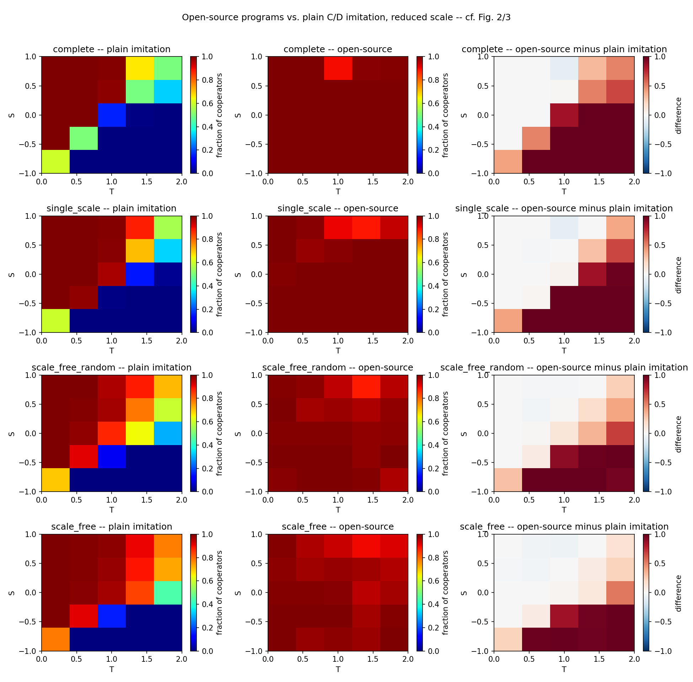

# Extension 3 — Open-source game theory: agents that read each other's code

**Question.** Under imitation, heterogeneous networks promote cooperation (the paper's
result). Does network structure still matter when agents can read each other's source code
before they act?

**Model.** Each agent holds a *program* instead of a strategy. When agents x and y meet, x
plays p_x(source of p_y) and y plays p_y(source of p_x). The payoff comes from the same
(T, S) matrix as before. The menu has five programs from Barasz et al. (2014):
CooperateBot, DefectBot, CliqueBot (cooperates only with exact copies of itself), FairBot
(cooperates if it can prove the opponent will cooperate with it) and PrudentBot (like
FairBot, but it also exploits CooperateBot). By Löb's theorem, FairBot and PrudentBot
cooperate with each other and with themselves. The outcome of every pairing is worked out
once and stored in a table, with a source for each entry (`programs.py`). The imitation
rule is unchanged and copies a neighbour's program. Agents start with a random program
(one fifth each). The setup is the same reduced-scale 5×5 grid on all four networks.
Cooperation is measured as the fraction of C actions per meeting.

**Result 1: code-reading replaces the network.** Cooperation reaches 0.97–1.00 on every
network, including the Prisoner's Dilemma region (T > 1, S < 0), where plain imitation gets
0. DefectBot goes extinct. The topology ordering disappears and even reverses slightly.
Heterogeneous networks keep CliqueBot alive (2% of agents on complete, 14% on
Barabási–Albert), and CliqueBot and FairBot defect on each other.

| Network | Plain imitation | Open-source |
|---|---|---|
| Complete | 0.49 | 0.99 |
| Single-scale | 0.57 | 0.99 |
| Random scale-free | 0.62 | 0.98 |
| Barabási–Albert | 0.65 | 0.97 |

**Result 2: when code-reading has a cost, the network matters again.** In this follow-up,
code-reading programs pay a cost per game (Critch et al., Open Problem 9). Mean cooperation
over the grid:

| Cost | Complete | Single-scale | Random scale-free | Barabási–Albert |
|---|---|---|---|---|
| 0 | 0.99 | 0.99 | 0.98 | 0.97 |
| 0.2 | 0.98 | 0.98 | 0.97 | 0.97 |
| 0.5 | 0.71 | 0.87 | 0.87 | 0.91 |
| 1.0 | 0.50 | 0.58 | 0.61 | 0.64 |

Costs up to 0.2 change nothing. At 0.5 the complete graph falls behind. Each run there ends
all-cooperative or all-DefectBot, while clusters of code-readers survive on structured
networks. At 1.0 (equal to the reward R) code-readers die out, and the numbers match plain
imitation, including the paper's ordering. This also checks that the code is correct.

**Takeaway.** Transparency and network structure act as substitutes. When reading code is
cheap, the network doesn't matter. As it gets expensive, network reciprocity takes over
again. The switch lies between cost 0.2 and 0.5.

**Caveats.** Everything is at reduced scale (N=500, 360 generations, 10 realizations). The
program menu is fixed, so the open-source part lives in the outcome table. PrudentBot is the
unbounded version. The bounded CUPOD/DUPOC agents of Critch et al. (2022) are left out
because some of their pairings are unsolved. Code-readers start at 60% of the population,
and invasion from a small minority is not tested. CliqueBot pays the same cost as a proof,
although its check is cheaper.

Details: `ARCHITECTURE.txt`, `CONCLUSIONS.txt`, `test_*.txt` (sources: [`../REFERENCES.md`](../REFERENCES.md)). Main
scripts: `open_source_experiment.py`, `cost_experiment.py <cost>`.
