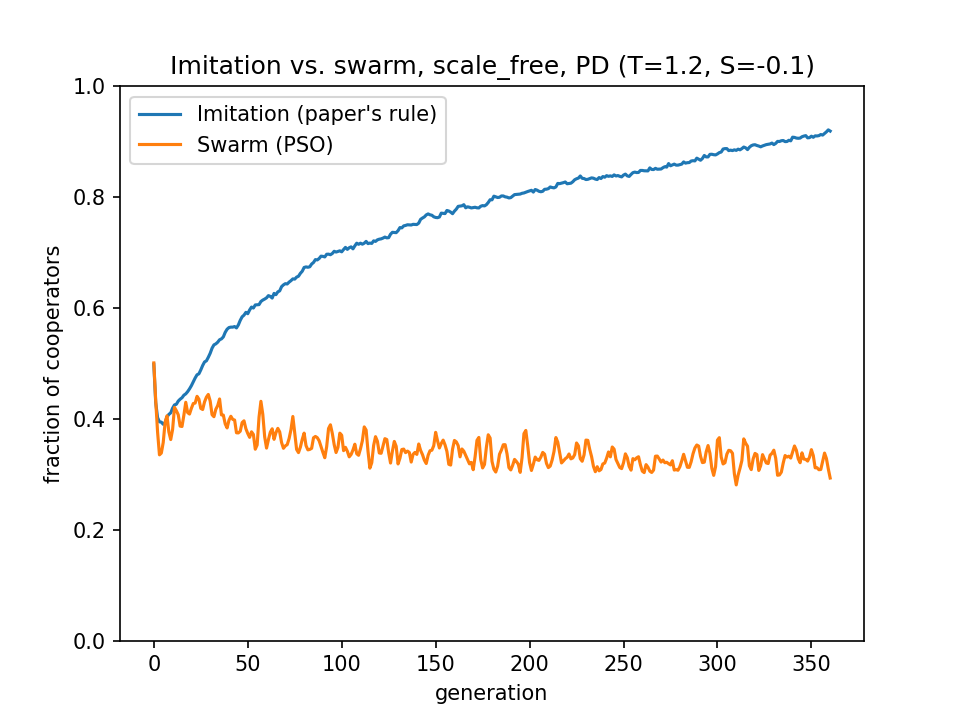

# Extension 1: imitation vs. swarm update rule

**Question.** If the paper's imitation rule is replaced with particle-swarm optimisation
(PSO), holding the game and network fixed, what happens to cooperation?

**Model.** Everything else is the same as the replication: a Prisoner's Dilemma
(T=1.2, S=−0.1) on a Barabási–Albert network with N=500, 10 realizations and 300 + 60
generations. Each agent holds a position x ∈ [0,1] and plays C if x > 0.5. Its velocity is
updated as

v ← w·v + c₁r₁(p − x) + c₂r₂(ℓ − x),  w=0.7, c₁=c₂=1.5 (standard defaults)

where *p* is the agent's best-ever position (its personal best) and *ℓ* is the position
of the highest-payoff agent in its neighbourhood, including itself (a local-best topology).

**Result.** Imitation reaches **0.90** cooperation and swarm plateaus at **0.33**.

**Mechanism** (instrumented, not assumed). The personal best is a running maximum. In a PD
the highest payoff anyone can get is from defecting against cooperators, and those
opportunities are common early on. By the end, 443 of the 500 agents (89%) have a personal
best on the defection side. Their mean personal-best payoff (4.22) is about 7× what anyone
is currently earning (0.61), so these are stale early windfalls. The memory term keeps
pulling agents back toward defection. Imitation compares only current payoffs, so it has
no such anchor.

**Takeaway.** PSO's memory assumes a static fitness landscape. Payoffs in a social dilemma
are frequency-dependent, so a remembered best becomes a misleading target.

Details: `ARCHITECTURE.txt` (design) and `CONCLUSIONS.txt` (diagnostic). Run it with
`python3 compare_imitation_vs_swarm.py`.
