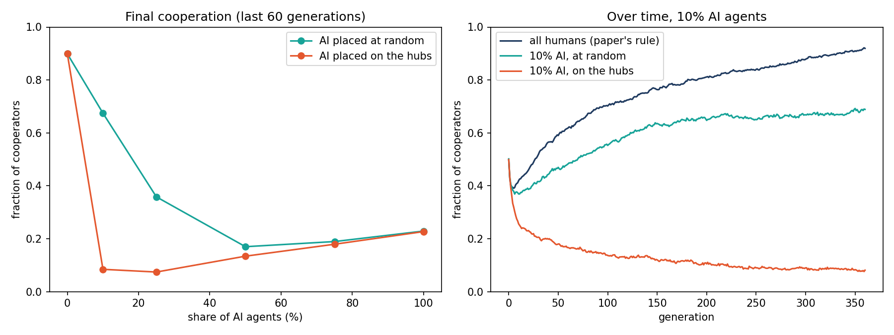
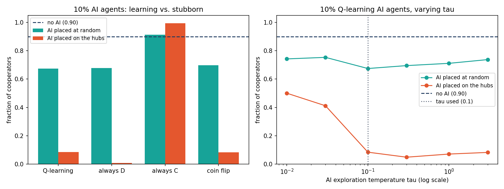

# Extension 6 — Hybrid population: humans imitate, AI agents use Q-learning

**Question.** Some players are AI agents that learn by reinforcement learning. The rest are
humans who keep the paper's imitation rule. Does cooperation survive, and does it matter
where the AI agents sit?

**Model.** It uses the same Prisoner's Dilemma ($T=1.2$, $S=-0.1$) and Barabási–Albert network as
[extension 1](../extension-1-swarm-learning/): $N=500$, 10 realizations, 300 + 60 generations.

- **Humans** keep [`update_rule.py`](../../update_rule.py) unchanged.
- **AI agents** use stateless Q-learning (Watkins & Dayan, 1992), in the form given by
  Bloembergen et al. (2015):

$$Q(a) \leftarrow Q(a) + \alpha\,[\,r - Q(a)\,], \qquad p(C) = \frac{1}{1+e^{-(Q_C - Q_D)/\tau}},$$

with $\alpha = 0.1$ and $\tau = 0.1$. The reward $r$ is the payoff per game (payoff / degree).
The share of AI agents goes from 0% to 100%. They are placed either **at random** or **on the hubs**
(highest degree first). Choices without a source are listed in `ARCHITECTURE.txt`.

**Result.** The AI agents on the hubs are only 10% of the population, but they cut
cooperation from **0.90** to **0.08**. The same share placed at random leaves **0.67**.

| AI share | 0% | 10% | 25% | 50% | 100% |
|---|---|---|---|---|---|
| AI at random | 0.90 | 0.67 | 0.36 | 0.17 | 0.23 |
| AI on the hubs | 0.90 | 0.08 | 0.07 | 0.13 | 0.23 |

**Mechanism** (instrumented, not assumed). With 10% AI on the hubs:

- The AI hubs touch 364 of the 450 humans directly.
- They are the best-paid players, earning 2.15 against 0.67 for humans.
- Humans copy them, and they mostly defect.

On scale-free networks a defecting hub gets retaken (Santos & Pacheco, 2005), because it imitates a cooperating neighbour
once its own payoff drops. An AI hub never imitates, so it is never retaken. Humans end up
cooperating *less* than the AI agents: the AI keep exploring, while the humans lock onto
defection.

**Control: is it Q-learning, or just hubs that never imitate?** We swap the Q-learners for
stubborn AI agents that never learn ([`control_rules.py`](control_rules.py)): always defect,
always cooperate, or coin flip. At 10% on the hubs, coin-flip hubs give **0.083**, the same as
Q-learning hubs (**0.084**). So the collapse doesn't need learning, only hubs that never imitate.
The hubs work as a lever in both directions: always-defect hubs give 0.007, and always-cooperate
hubs give 0.994, above the all-human 0.90.

**Robustness: exploration $\tau$.** For $\tau \ge 0.1$ the hub collapse holds (0.05–0.08). Below
that it weakens (0.50 at $\tau = 0.01$). Greedy learners freeze on their random first move:
49 of 50 AI hubs never switched. That makes them a mix of stubborn cooperators and defectors.

**Takeaway.** The paper's result that "hubs anchor cooperation" only works if the hubs
imitate. Hubs that don't imitate decide the network's cooperation themselves, whatever rule
drives them. A small share of such hubs is enough. Whether the network cooperates then
depends on what those hubs play, not on the humans.

**Caveats.**
- Reduced scale, with one $(T, S)$ point and one network type.
- $\alpha$ is not swept yet.
- It runs on a synthetic BA network, not the FM supply-chain network yet.

Details: `ARCHITECTURE.txt` (design) and `CONCLUSIONS.txt` (diagnostics). Run it with:
- `python3 hybrid_experiment.py`, then `python3 plot_hybrid.py`;
- `python3 control_experiment.py`, `python3 tau_sweep.py`, then `python3 plot_controls.py`.
