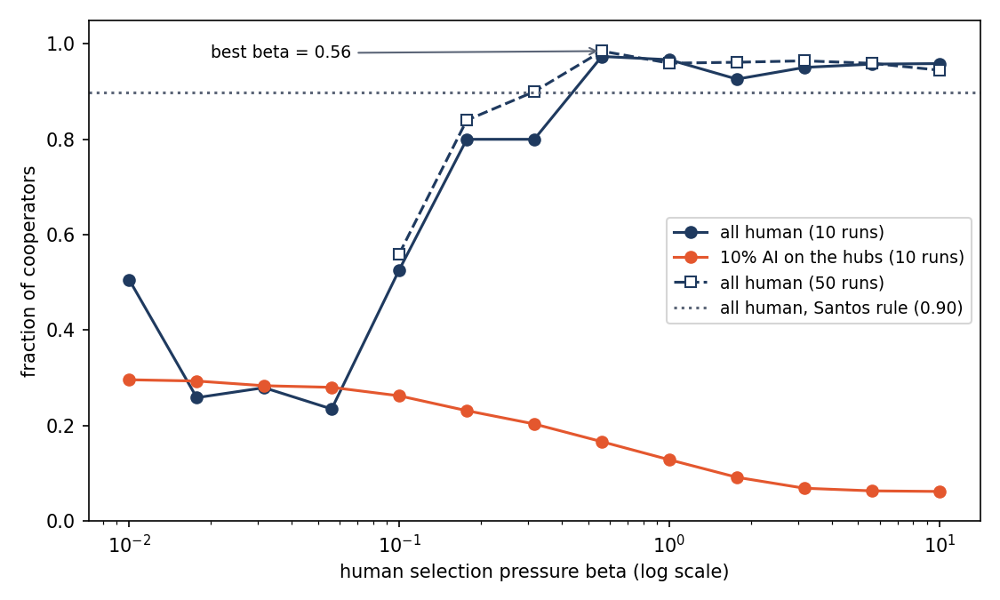

# Extension 7 — Selection pressure: humans imitate with the Fermi rule

**Question.** Pinheiro, Santos & Pacheco (2012) show that on scale-free networks there is a
value of the selection pressure $\beta$ that maximizes cooperation. Which $\beta$ is that in our
simulation? And does any $\beta$ rescue cooperation once AI agents sit on the hubs
([extension 6](../extension-6-hybrid-population/))?

**Model.** Same Prisoner's Dilemma ($T=1.2$, $S=-0.1$), Barabási–Albert network and scale as
extension 6: $N=500$, 300 + 60 generations. One swap: humans imitate a random neighbour with the
Fermi rule (Pinheiro et al., 2012) instead of the paper's rule,

$$p = \frac{1}{1+e^{-\beta\,(f_y - f_x)}},$$

where $f$ is the accumulated payoff. $\beta = 0$ is a coin flip (random drift); large $\beta$
copies any better-off neighbour almost surely. AI agents, if any, keep extension 6's
Q-learning ($\alpha = \tau = 0.1$). $\beta$ runs from 0.01 to 10, four values per decade.

**Result.** All human, cooperation peaks at **$\beta \approx 0.56$** (0.985 over 50 runs), then
dips slightly (0.945 at $\beta = 10$), the same shape as Pinheiro et al. With 10% AI agents on
the hubs, **no $\beta$ helps**: cooperation falls steadily as $\beta$ grows.

| $\beta$ | 0.01 | 0.1 | 0.56 | 1 | 10 |
|---|---|---|---|---|---|
| All human (10 runs) | 0.51 | 0.53 | **0.97** | 0.97 | 0.96 |
| All human (50 runs) | — | 0.56 | **0.985** | 0.96 | 0.945 |
| 10% AI on the hubs | 0.30 | 0.26 | 0.17 | 0.13 | 0.06 |

Below $\beta = 0.1$ the all-human runs are drift: each run ends all-C or all-D by chance, so the
mean is noisy. The optimum beats the paper's rule (0.90, dotted line).

**Takeaway.** Humans who follow payoffs more closely help cooperation, up to a point, when the
hubs are human imitators. When the hubs are AI agents that never imitate, following payoffs
more closely makes it worse: the AI hubs are the best-paid players and mostly defect, so humans
copy them faster. Linking this to Pinheiro et al.'s hub mechanism is my framing, no source.

**Caveats.**
- The peak is weak: 48 vs. 43 of 50 runs end all-C at $\beta = 0.56$ vs. $\beta = 10$.
- Synchronous updates; Pinheiro et al. update one random individual at a time (design choice, no source).
- Our game is $T=1.2$, $S=-0.1$, not their one-parameter $T=\lambda$, $S=1-\lambda$ form.
- Reduced scale: $N=500$, 10–50 runs, 360 generations (they use $N=1000$ and a far longer transient).

Details: `CONCLUSIONS.txt`. Run it with `python3 beta_sweep.py`, `python3 peak_check.py`,
then `python3 plot_beta.py`. Each function has a terminal test in `tests/`.
