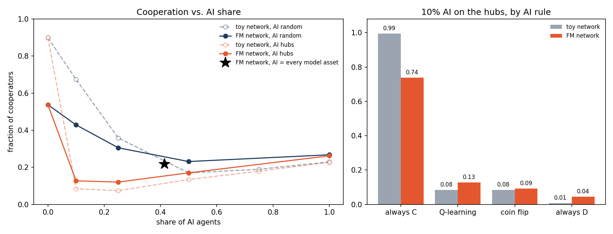

# Extension 8 — The real network: foundation-model supply chain

**Question.** [Extension 6](../extension-6-hybrid-population/) found that 10% AI agents on the
hubs of a Barabási–Albert network collapse cooperation. Does that survive on a real network of
AI agents, where the hubs really are models?

**Model.** Extension 6 unchanged (Prisoner's Dilemma $T=1.2$, $S=-0.1$; humans imitate with the
paper's rule; AI agents use Q-learning, $\alpha=\tau=0.1$; 10 runs, 300 + 60 generations), with one
swap: the network. Instead of a fresh Barabási–Albert graph per run, every run plays on the
giant component of the foundation-model supply chain (Ecosystem Graphs release
`fm-2024-05-d3c06a4`, loaded from fm-networks-labs, not copied here): 503 assets, 650 links.

| | Toy (BA, $m=2$) | FM network |
|---|---|---|
| Nodes / links | 500 / ~996 | 503 / 650 |
| Average degree | 3.98 | 2.58 |
| Top hub | ~58 links | 19 (LLaMA) |
| Leaves (1 link) | 0 | 230 |

Design choices, no source: links are undirected (both ends of a dependency play each other);
one fixed graph, seeds change the rest; a new placement "models" makes every model asset AI
(208 of 503, 41%); a degree-preserving rewire is the null model. Full list: `ARCHITECTURE.txt`.

**Result.** The real network holds less cooperation to begin with, and is just as fragile to AI hubs.

| AI share | 0% | 10% | 25% | 50% | 100% |
|---|---|---|---|---|---|
| FM, AI at random | 0.54 | 0.43 | 0.31 | 0.23 | 0.27 |
| FM, AI on the hubs | 0.54 | **0.13** | 0.12 | 0.17 | 0.26 |
| Toy, AI at random | 0.90 | 0.67 | 0.36 | 0.17 | 0.23 |
| Toy, AI on the hubs | 0.90 | **0.08** | 0.07 | 0.13 | 0.23 |

Every model asset as AI: **0.22**. Same degrees, rewired at random: 0.62 all human, 0.11 with 10%
AI hubs. At 10% hubs, by AI rule (FM vs. toy): always cooperate 0.74 vs. 0.99, Q-learning 0.13
vs. 0.08, coin flip 0.09 vs. 0.08, always defect 0.04 vs. 0.01.

**Takeaway.** The real network changes the numbers, not the story: hubs that never imitate
decide cooperation. It starts lower because of its degrees (sparse, many leaves, small hubs),
not its exact wiring, as the rewired null shows. Reading, my framing, no source.

**Caveats.**
- Undirected play; a directed version (downstream copies upstream only) is not run.
- Who is "human" on a supply chain of models, datasets and apps is an open modelling question.
- All human is still rising at 360 generations (0.61 by 1500); the AI placements are stable to 1500.
- 10 runs, one fixed graph.

Details: `CONCLUSIONS.txt`, `ARCHITECTURE.txt`. Run `python3 fm_experiment.py` (about 30 s), then
`python3 plot_fm.py`. Each function has a terminal test in `tests/`.
