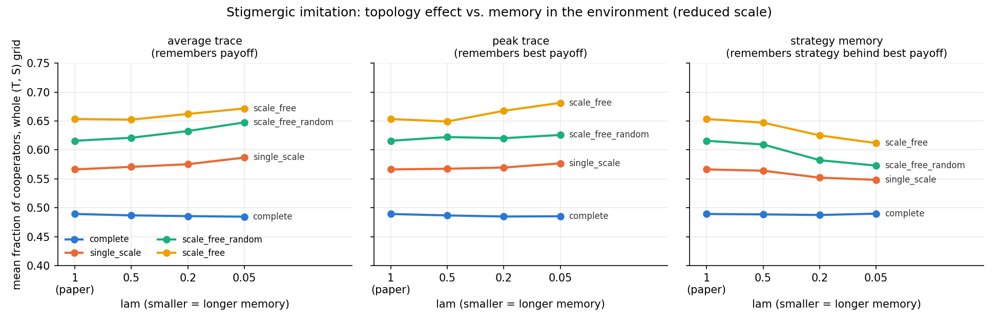

# Extension 3 — Stigmergic imitation: learning from traces in the environment

**Question.** Under imitation, heterogeneous networks promote cooperation (the paper's
result). Does that still hold when agents learn from a fading record left at each node,
instead of seeing a neighbour's current payoff? The idea comes from SwarmWorld (Pal, Wang &
Buehler, 2026), where about 95% of reuse among LLM agents began by observing artifacts left in
the world rather than by direct contact.

**Model.** Each node keeps a *trace* of the payoffs earned there:
trace ← (1 − λ)·trace + λ·payoff. Agent x picks a random neighbour y, as in the paper, and
compares its own current payoff with y's trace. If the trace is higher, x copies y's strategy
with the paper's probability. λ=1 is exactly the paper's rule (checked: same seed, identical
run). Smaller λ means longer memory. Two controls were added to test hypotheses:
- **Peak trace**: jumps up to any new high payoff and fades down at rate λ. It holds on to
  windfalls, like PSO's personal best.
- **Strategy memory**: the peak trace plus the strategy that earned it. x copies that
  remembered strategy, not y's current one. This is the closest match to PSO's personal best.

Everything else is the same as [swarm topology](../replication-extension-swarm-topology/):
the reduced-scale 5×5 (T, S) grid on all four networks, with the same seeds.

**Result 1: a payoff trace leaves the paper's result intact.** The ordering holds at every
λ, and long memory nudges heterogeneous networks slightly up. This is the opposite of what we
predicted.

**Result 2: holding on to windfalls is not what hurts.** The peak trace doesn't lower
cooperation either.

**Result 3: remembering the strategy is what hurts.** With strategy memory, cooperation falls
as memory gets longer, but only on structured networks. The losses sit in the Snowdrift
region (T > 1, S > 0), with −0.2 to −0.3 at several points on the scale-free networks. The
ordering survives but shrinks: BA minus complete goes from 0.16 to 0.12.

Mean cooperation over the (T, S) grid at λ=0.05 (λ=1 is the paper's rule):

| Network | λ=1 (paper) | Average trace | Peak trace | Strategy memory |
|---|---|---|---|---|
| Complete | 0.49 | 0.48 | 0.49 | 0.49 |
| Single-scale | 0.57 | 0.59 | 0.58 | 0.55 |
| Random scale-free | 0.62 | 0.65 | 0.63 | 0.57 |
| Barabási–Albert | 0.65 | 0.67 | 0.68 | 0.61 |

**Takeaway.** What memory stores matters more than how long it lasts. A remembered payoff is
harmless, while a remembered strategy weakens network reciprocity. Learning from traces in the
environment is compatible with the paper's topology effect, as long as agents still copy
what their neighbours do now.

**Caveats.** Everything is at reduced scale (N=500, 360 generations, 10 realizations).
Grid-mean differences of about 0.02 are within noise. The Prisoner's Dilemma corner is 0 for
every rule at this scale, including the paper's. Unlike PSO's personal best, the strategy
memory fades and belongs to the node, not the agent, so the remaining gap with PSO is
untested.

Details: `ARCHITECTURE.txt`, `CONCLUSIONS.txt`, `tests/` (sources: [`../REFERENCES.md`](../REFERENCES.md)).
Main scripts: `lam_experiment.py <lam> [average|peak|strategy]`, `plot_lam_curve.py`.
