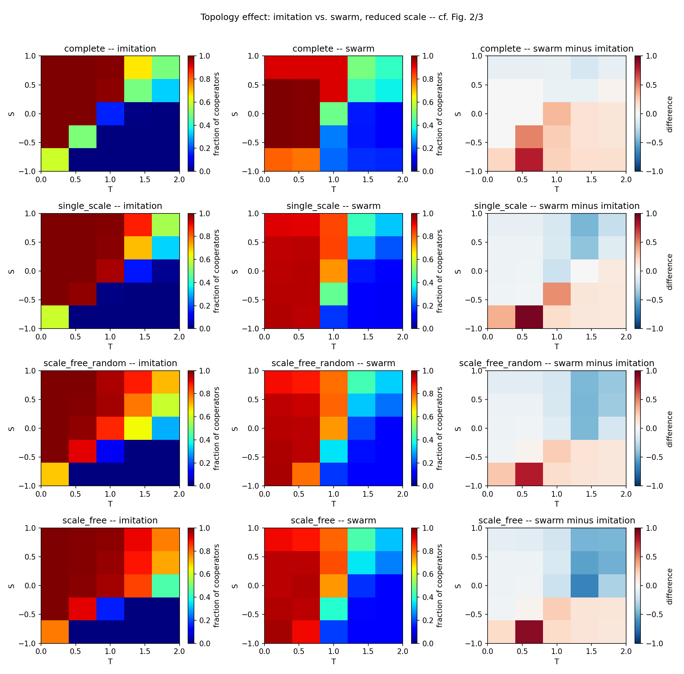

# Extension 2 — Swarm topology: does the topology effect survive swarm learning?

**Question.** Under imitation, heterogeneous networks promote cooperation (the paper's
result). Does that still hold when agents learn by particle-swarm optimisation (PSO,
see Extension 1, [swarm learning](../replication-extension-swarm-learning/))?

**Design.** The update rule is fixed as swarm. The network varies across the paper's four
types, on the reduced-scale 5×5 $(T, S)$ grid. Imitation is re-run with the same seeds as a
baseline. We then vary $c_1$, the weight of each agent's personal-best memory.

**Result 1: with default swarm ($c_1=1.5$), the topology effect disappears.**

Mean cooperation over the $(T, S)$ grid:

| Network | Imitation | Swarm $c_1=1.5$ | Swarm $c_1=0$ |
|---|---|---|---|
| Complete | 0.49 | 0.59 | 0.45 |
| Single-scale | 0.57 | 0.58 | 0.76 |
| Random scale-free | 0.62 | 0.57 | 0.87 |
| Barabási–Albert | 0.65 | 0.58 | 0.88 |

**Result 2: removing memory ($c_1=0$) restores the effect, and it becomes stronger than under
imitation.** Cooperation in the PD region is carried by stable, hub-anchored clusters
(e.g. at $T=1.5$, $S=-0.5$, 456 of 500 agents cooperate in every one of the last 60
generations, including all 25 largest hubs).

**Result 3: the effect declines steadily as $c_1$ increases, while stable PD cooperation
vanishes already at $c_1=0.25$.** A velocity test shows agents come to rest only when $c_1=0$.
With any memory, the personal and neighbourhood targets never coincide, so agents keep
oscillating and clusters cannot persist.

**Takeaway.** The benefit of network structure depends on the learning rule. Purely social
learners use the network; learners with persistent self-memory do not.

**Caveats.** Everything is at reduced scale ($N=500$, 360 generations, 10 realizations). At
this scale imitation shows 0 cooperation in the PD corner on every network, unlike the
paper. With $c_1>0$, swarm's PD values ($\approx 0.12$) are threshold flicker, not cooperation. The
link between motion and broken clusters is a correlation (2 grid points, 3 seeds) and has
not been shown to be causal.

Details: `ARCHITECTURE.txt`, `CONCLUSIONS.txt`, `tests/`. Main scripts:
`topology_experiment.py`, `c1_zero_experiment.py`, `c1_sweep.py <c1>`, `velocity_test.py`.
